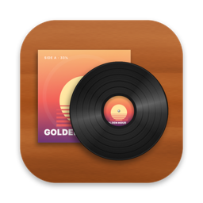
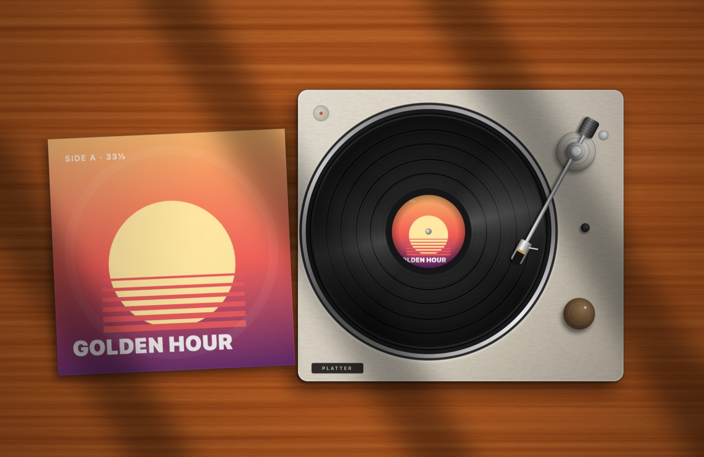
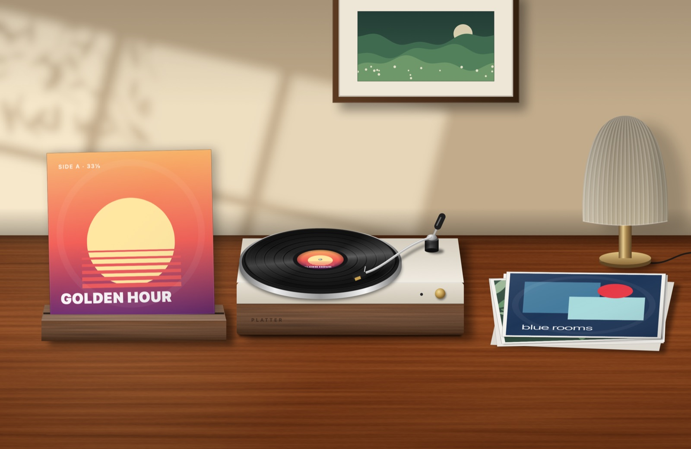
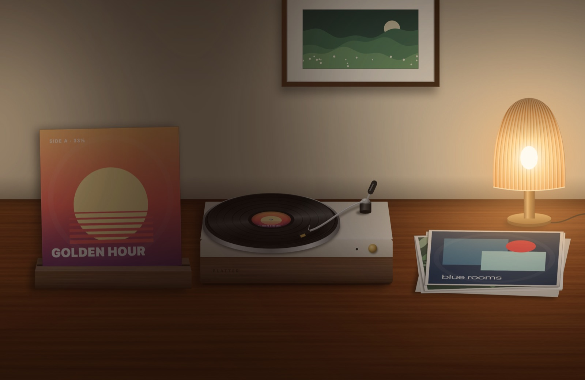
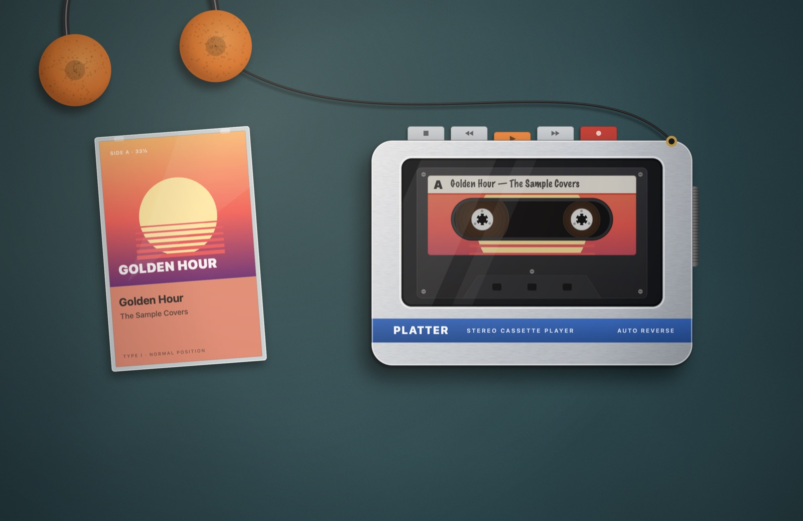
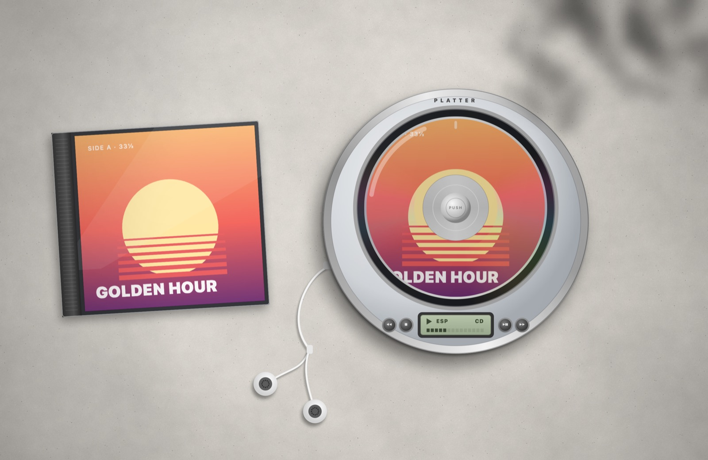
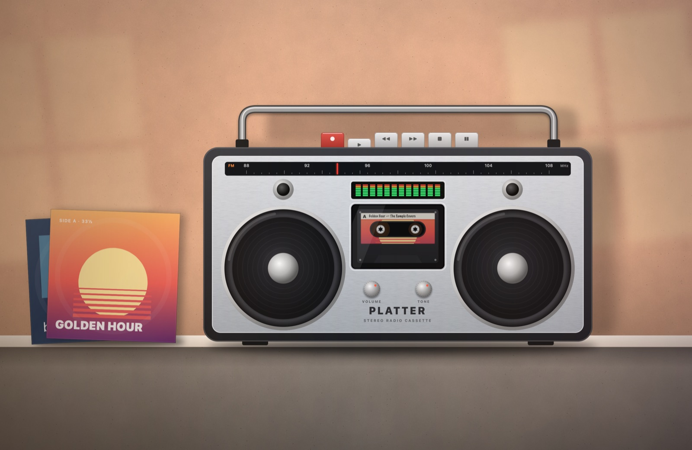

<p align="center"></p>

<h1 align="center">Platter</h1>

<p align="center">Your music, playing on your desktop.<br>
A tiny macOS menu bar app that turns whatever you're listening to in Spotify or Apple Music into a living desktop scene.</p>



The current album cover becomes the sleeve, the record label, the cassette sticker or the CD print. Records spin, tape winds from spool to spool, keys press when you play, pause or skip, and the scene fades back to your normal wallpaper when nothing is playing.

## Scenes

| | |
|---|---|
|  **Listening Room** — sunlit desk, record on the deck, recently played covers in a stack |  **After Hours** — the same room at night, lamp on. Can switch automatically at 19:00 / 07:00 |
|  **Turntable** — top-down deck; the tonearm drops in when you press play and tracks the song's progress |  **Cassette** — portable tape player; Play latches down, spools wind as the track plays |
|  **Discman** — the disc printed with the cover spins under a smoked lid, LCD shows progress |  **Boombox** — thumping speakers, dancing EQ, a tuning needle that follows the song |

*Screenshots use made-up sample covers; in use you'll see your own albums.*

## Features

- Works with **Spotify** and **Apple Music**
- Lives in the menu bar — no Dock icon. Left click for the panel (now playing, progress, ⏮ ⏯ ⏭, scenes), right click for a quick scene menu
- Animated with Core Animation, so idle CPU stays near zero
- Optional: hide the scene while paused, switch the room to night after 7 PM, launch at login
- Multiple displays supported
- Free and open source (MIT)

## Install

1. Download `Platter-x.y.dmg` from [Releases](../../releases) and drag **Platter** to **Applications**.
2. The app isn't notarized, so macOS blocks the first launch. Open it once, then go to **System Settings → Privacy & Security** and click **Open Anyway**. Or run:
   ```bash
   xattr -dr com.apple.quarantine /Applications/Platter.app
   ```
3. When asked, allow Platter to control **Spotify** / **Music** — that's how it reads the current track. You can change this later in **System Settings → Privacy & Security → Automation**.

Can't find the menu bar icon? On MacBooks with a notch, icons can hide behind it when the menu bar is full. Open Platter again from Applications or Spotlight and its panel appears as a window.

Requires macOS 14 Sonoma or later. Universal: Apple Silicon and Intel.

## Build from source

Needs Xcode 15+ (or the Swift toolchain that ships with it).

```bash
git clone https://github.com/Aqpanbek/platter.git
cd platter
./build.sh            # → build/Platter.app
./build.sh --dist     # → also dist/Platter-<version>.dmg and .zip
```

Preview every scene without launching the app:

```bash
swift build -c release && .build/release/Platter --render /tmp/platter
```

## How it works

- **Now playing** — `Sources/Platter/NowPlaying.swift` asks Spotify and Music over AppleScript (and listens to their playback notifications) for the track, its position and the artwork. If a cover can't be read from the player, it is looked up in the iTunes Search API.
- **Desktop** — `Sources/Platter/DesktopController.swift` puts a borderless, click-through window on every screen at desktop level: above the wallpaper, below your icons.
- **Scenes** — `Sources/Platter/Render/` draws every scene procedurally with Core Graphics (wood, concrete and felt textures are generated noise; no image assets). Motion is Core Animation: spinning records and spools, key presses, the tonearm, speaker thump and cross-fades on track change.

### Adding a scene

Subclass `DesktopScene`, lay out your layers in `build()` on the 1600×1040 design canvas, react in `artworkDidChange`, `playbackDidChange`, `progressDidChange` and `trackSkipped`, then add a case to `SceneKind`.

## Privacy

Platter talks only to your local Spotify / Music apps. The one network request it makes is the artwork fallback: when a player doesn't hand over a cover, the artist and album name are sent to Apple's iTunes Search API to find it. No analytics, no accounts.

## License

[MIT](LICENSE)
